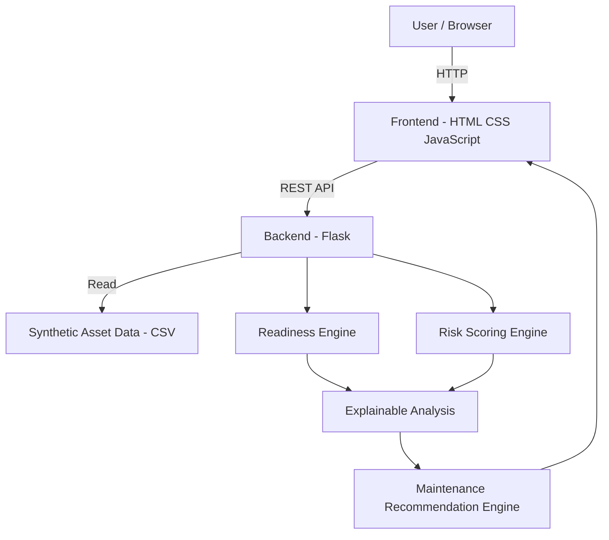

# Architecture

## System Architecture

MissionGuard AI follows a lightweight architecture designed for an explainable predictive-maintenance proof of concept. Synthetic sensor and maintenance data is loaded from a CSV file, processed by a Flask backend, analyzed by readiness and risk engines, and presented through a web dashboard.

## Components

| Component | Technology | Responsibility |
|---|---|---|
| Frontend | HTML, CSS, JavaScript | Dashboard UI, asset selection, readiness and risk visualization |
| Backend API | Python, Flask | Business logic, API endpoints, and data processing |
| Readiness Engine | Python | Classifies assets as READY, CAUTION, or NOT READY |
| Risk Scoring Engine | Python | Calculates proof-of-concept asset risk scores and risk levels |
| Explainable Analysis | Python | Identifies conditions contributing to asset risk |
| Maintenance Recommendations | Python | Generates prioritized maintenance recommendations |
| Data | CSV | Stores synthetic asset sensor and maintenance data |

## Data Flow
1.Synthetic asset sensor and maintenance data is loaded from src/data/assets.csv.
2.The Flask backend processes the asset data.
3.Sensor and maintenance conditions such as vibration, temperature, pressure, usage, and maintenance history are evaluated.
4.The readiness engine classifies each asset as READY, CAUTION, or NOT READY.
5.The risk scoring engine calculates a proof-of-concept risk score and assigns a LOW, MEDIUM, or HIGH risk level.
6.The system identifies the conditions contributing to the calculated risk.
7.Maintenance recommendations are generated based on the detected conditions.
8.The processed results are returned through the Flask REST API.
9.The web dashboard displays the readiness status, risk information, detected issues, and maintenance recommendations.

## Security Considerations

-Only synthetic demonstration data is used.
-No real operational or military data is stored in the application.
-API keys, credentials, and other secrets must not be committed to the repository.
-The .env file is intended for local environment configuration and should not be committed.
-The readiness and risk logic is a proof-of-concept and is not validated for real-world operational use.
-The application is designed as decision-support software and does not make autonomous real-world mission decisions.

## Scalability Notes

The current CSV-based architecture is intentionally lightweight for the hackathon prototype.

Beyond the prototype, the CSV data source could be replaced with a database or scalable data pipeline. The Flask backend could be deployed as a service, while the current rule-based risk scoring could be replaced or enhanced with validated machine-learning models trained on appropriate datasets.

Real-time or scheduled sensor-data ingestion could also be added in a future version.

This version is **aligned with the code you actually built** and removes all the template's `[e.g.]` placeholders. It also keeps the required **Mermaid diagram, components, data flow, security, and scalability** sections. :contentReference[oaicite:0]{index=0}
